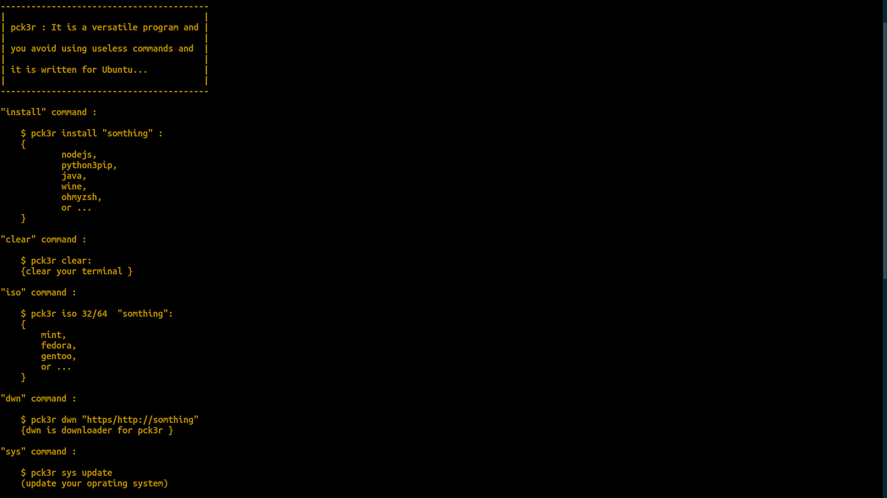

  

# pck3r :

Pck3r is a modern package manager for Ubuntu. It acts as a simple tool that helps users manage software with APT, or Advanced Package Tool. Pck3r makes installing, updating, and managing software easier with a clear interface and straightforward commands.

# logo :

    尸⼕长㇌尺

# system wide installation :

*for system wide installation :*

$ ./setup.py

# pck3r commands

"install" command :

    $ pck3r install "somthing" :
    {
        nodejs,
        ohmyzsh,
        or...
    }
    
"clear" command :

    $ pck3r clear:
    clear your terminali (only for fun :D)

"sys" command :

    $ pck3r sys update
    update your oprating system

    $ pck3r sys upgrade
    upgrade your oprating system

    $ pck3r sys updgr
    update and full-upgrade, Include snap's packages.

"pkg" command :

    $ pck3r pkg <package name>"
    (search for packages ...)"

"update" command :

    $ pck3r update
    update to last release from github.com/amzyei/pck3r

"version" command :

    $ pck3r version
    this command show pck3r version

